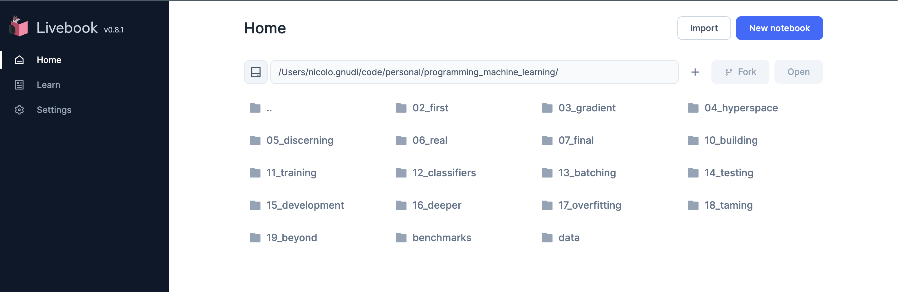

# Programming Machine Learning: From Coding to Deep Learning - Elixir Livebooks

> Last year (2022), one of my New Year's resolutions was to get into Machine Learning. So, I grabbed a digital copy of this book called ["Programming Machine Learning"](https://pragprog.com/titles/pplearn/programming-machine-learning/) book by [P. Perrotta](https://github.com/nusco) and started my journey. It took a bit longer than I expected, but it was totally worth it in the end.

[Programming Machine Learning](https://pragprog.com/titles/pplearn/programming-machine-learning/) is an hands-on book, it guides you through the creation of an image recognition application from scratch with supervised learning, iteratevely and step-by-step.

All the code examples are in Python/numpy (see [Source Code](https://pragprog.com/titles/pplearn/programming-machine-learning/#resources)), but I decided to give Elixir a spin using Livebook, Nx and company.

## Repository Structure

The repository contains different Livebooks, around one per chapter, and each of them mirrors the corresponding Jupyter Book in the [Source Code](https://pragprog.com/titles/pplearn/programming-machine-learning/#resources) provided with the book.

## Prerequisites

* Erlang and Elixir (https://elixir-lang.org/install.html)

I personally tested it with:

* erlang 25.1.2
* elixir 1.14.2-otp-25

### Livebook

You can install and run [Livebook](https://livebook.dev) in different ways:

* The most convenient one is to download the Livebook Desktop App (https://livebook.dev/#install)

Otherwise:

* via [Docker](https://github.com/livebook-dev/livebook#docker) (the repository has a `docker-compose.yml` file already)
* using [Escript](https://github.com/livebook-dev/livebook#escript) which comes with a convenient CLI

## How to run the livebooks?

* Git clone the repository in your local machine, then:

If you have the Livebook Desktop App installed locally:

* Launch the app and navigate to the cloned repo locally, select one of the livebook and click on the "Open" button.

If you installed Livebook via Escript:

* run `livebook server --home </path/to/the/repo>` (the `home` option will launch Livebook in the repository root folder), then select one of the livebook and click on the "Open" button.

If you want to launch Livebook via Docker:

* run `docker-compose up`, it will launch Livebook in the repository root folder, then select one of the livebook and click on the "Open" button.

## Additional notes

### Differences between Livebook an Jupyter books

* I could replicate all the different Jupyter books in Elixir with Livebook/Nx/Axon, apart from the 2nd section of Chapter 17, where the book introduces L1/L2 regularization techniques and these are not supported by [Axon](https://github.com/elixir-nx/axon) out of the box (more details in the corresponding Livebook).

### Code Style

* The Elixir code style used in the Livebooks is not the most idiomatic one because I aimed to keep it similar and comparable to the Python code in the Jupiter Book.

## Acknowledgements

* First, I want to thank [@nusco](https://github.com/nusco) for the well-written and entertaining book. It has been a pleasant reading and I can only recommend it.
* Then, I want to give a huge shoutout to the elixir-nx and Livebook teams (and contribuitors) for their incredible achievements in less than two years! I'm absolutely blown away by the ecosystem of libraries they've created to make Elixir a possible alternative to the more popular languages in the ML field. The ecosystem is evolving fast and I'm genuily curious to see what the future will bring!

## Contributing

Contributions are welcome! Feel free to open an issue or PR if something is not working as expected or if you see possible improvements ☺️.
